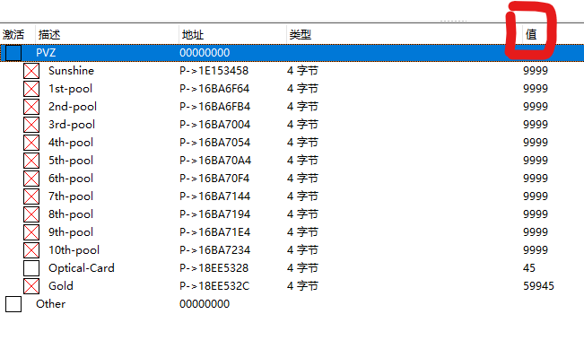

# PlantsVSZombies
Plants vs. Zombies light card, sun, gold and cooldown modification code for Cheat Engine on Windows

0. CE version 7.6, Plants vs. Zombies release date May 5, 2009

1. The interface after opening it with Cheat Engine (CE) is as follows:

    

    For ***1st-10th pool and Sunshine***, set the red framed value to a reference value of 9999. For ***Gold*** coins, the reference value can be 99999. For ***Optical-Card***, the reference value range is 1-50.

2. Use CE to lock relevant values.